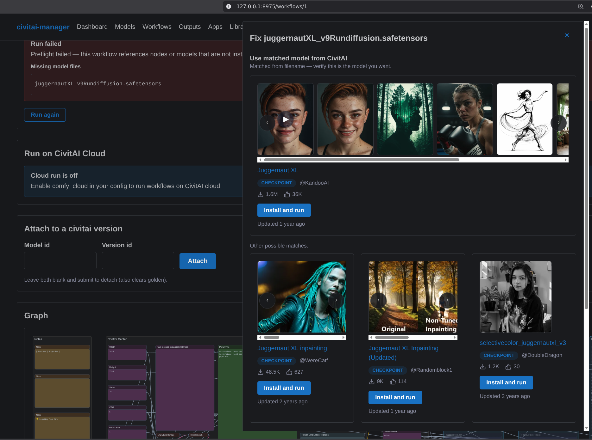
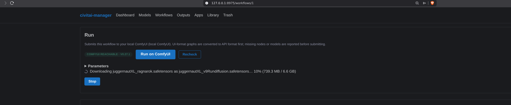
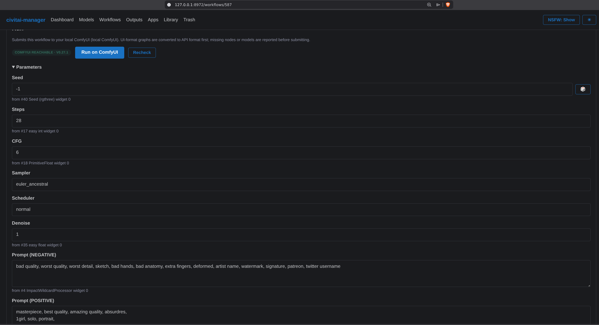
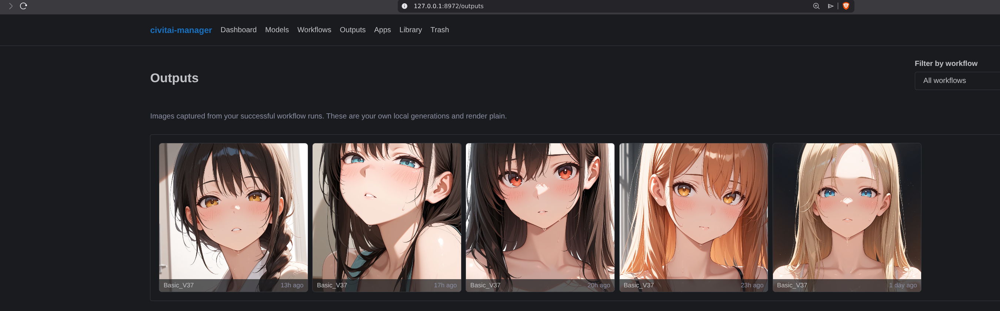
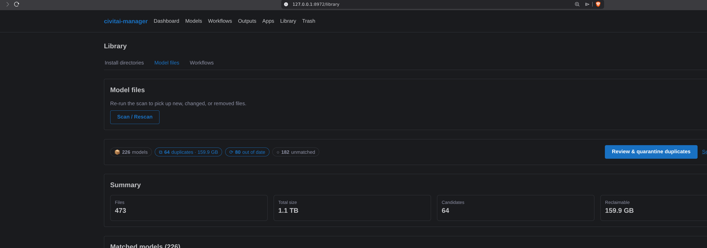

# civitai-manager

**Run a ComfyUI workflow you just downloaded — and let the models it needs fetch
themselves while the run waits.**

[](https://github.com/ZacxDev/civitai-manager/releases/latest)
[](LICENSE)
[](go.mod)
[](https://github.com/ZacxDev/civitai-manager/actions/workflows/ci.yml)

You grab a workflow off CivitAI. You drop it into ComfyUI. You hit Run, and it
dies on `value not in list: ckpt_name`. So you read the node, guess which
checkpoint it means, go hunt it on CivitAI, download it, drop it in the right
folder, hit Run again — and it dies on the *next* missing file.

civitai-manager takes that loop off your hands. Import the workflow, click Run,
and it checks the graph against your actual ComfyUI install, finds the model
files you're missing, resolves them on CivitAI (or HuggingFace), downloads them
into the correct `models/` subfolder, and **starts the run when the download
finishes**. You don't re-click.



> **One thing it does not do: install custom nodes.** It resolves and downloads
> **model files** only. If a workflow needs a node pack you don't have, it tells
> you exactly which nodes are missing — and then stops. Installing them is still
> your job. See [Limitations](#limitations).

A single Go binary, no cgo, no CDN, no account, no telemetry. It binds to
loopback, keeps its state in a local SQLite file, and the web UI is fully offline
— the CSS and htmx are compiled into the binary.

---

## 60-second quickstart

**1. Get the binary.**

```sh
curl -fsSL https://zacxdev.github.io/civitai-manager/install.sh | sh
```

The script detects your OS and CPU, verifies the download against the release's
`checksums.txt`, and installs to `/usr/local` if that is already writable or
`~/.local` otherwise — it will not ask for your password uninvited. Read it
first if you like: [`docs/install.sh`](docs/install.sh).

Or with Nix, without installing anything at all:

```sh
nix run github:ZacxDev/civitai-manager -- serve --comfy-model-path ~/ComfyUI/models
```

There are also `.deb`/`.rpm` packages, a Homebrew cask, and plain tarballs on the
[releases page](https://github.com/ZacxDev/civitai-manager/releases/latest) for
linux, macOS and Windows on amd64 and arm64 — see
**[all install options](docs/install.md)**.

**2. Start it, pointed at your ComfyUI models folder.**

```sh
civitai-manager serve --comfy-model-path ~/ComfyUI/models
```

`--comfy-model-path` is what enables downloading a missing model into the right
place. Without it you still get the diagnosis, just not the fix. Set it once in
the [config file](docs/configuration.md) so you don't have to pass it every time.

**3. Open <http://localhost:8787>.**

**4. Add a workflow.** Go to **Workflows** and either paste the workflow JSON,
drop in a **PNG that ComfyUI generated** (the graph is read out of its metadata),
or browse **Discover** to import one straight from CivitAI.

**5. Click Run.** If anything is missing, you get a panel telling you what — with
the fix attached where a fix is possible.

You'll want a **CivitAI API token** before downloading much: the public browse
endpoints work anonymously, but most file downloads need auth. Set `CIVITAI_TOKEN`
or drop it in the config — and if you already use the official `civitai` CLI,
your existing token is picked up automatically. See
[configuration](docs/configuration.md).

> **You need ComfyUI actually running** (default `http://127.0.0.1:8188`) for
> anything that runs, converts, or preflights a workflow. Roughly half the tool —
> subscriptions, downloads, the library scanner, workflow import and browsing —
> works with ComfyUI closed. There's a
> [full breakdown below](#what-needs-comfyui-running).

---

## Running workflows

**Import from anywhere.** Paste workflow JSON, extract the graph from a ComfyUI
PNG's metadata, scan your ComfyUI install for workflows already on disk, or
import from CivitAI's Workflow models (which ship as zips — it unpacks them for
you and skips graphs you already have).

**UI → API conversion that handles real-world graphs.** Workflows in the wild
aren't clean. The converter expands **subgraphs**, resolves **Get/Set teleport**
nodes back to their real source, splices through **bypassed and muted** nodes,
drops UI-only **rgthree** helper nodes, and handles converted-widget inputs
without shifting every widget value after them.

**Preflight before it costs you anything.** Every run is checked against your
live ComfyUI's `/object_info` first, and reports three separate things:

- **Missing custom nodes** — named, so you know what to install. *(No install
  action; see [Limitations](#limitations).)*
- **Missing models** — with the resolution flow below.
- **Incompatible options** — a saved sampler, scheduler, or other enum value your
  install doesn't have, shown next to a dropdown of the values it *does* have,
  so you can pick one and run. Your choice is re-validated against the real list
  server-side; an off-list value is refused, never injected.

**Missing-model resolution.** For each model file the graph wants but you don't
have, civitai-manager infers the model type, searches CivitAI, and offers:

- the **best match** plus **other possible matches** when several models fit, so
  you disambiguate instead of guessing;
- an **already-installed substitute** — run with a model you do have, without
  editing the workflow;
- **download and run** — it fetches the file into the correct `models/`
  subfolder and the run begins on its own when the download completes.



When CivitAI doesn't have the file, a **HuggingFace fallback** takes over — the
usual home of VAEs, upscalers, and detection models that never had a CivitAI
page. Auto-download there is deliberately narrow: it only fires for a curated
filename map or a recognised org, when the file isn't gated and its SHA256 is
known. Everything else becomes a link, with the reason stated.

**Edit the parameters without opening ComfyUI.** Prompt, seed, steps, cfg,
sampler, scheduler, denoise, width, height, and batch size — pulled from the
nodes that actually hold them, including through converted-widget links, and
shown with their provenance.



**The stored workflow is never modified.** Every edit, substitution, and option
fix is applied to an in-memory copy for that run only. The graph you imported
stays exactly as you imported it.

**Your outputs don't evaporate.** Every successful local run has its images
copied into an app-owned gallery, recorded with the parameters that produced
them. Re-run reconstructs those parameters. It's disk-capped (default 20 GiB,
oldest-first eviction — [read the note](docs/configuration.md#output-gallery-storage-and-its-automatic-deletion),
it deletes things), and it survives ComfyUI clearing its own output folder.



**Open in ComfyUI** saves the graph into ComfyUI's own Workflows menu. An
optional helper extension — installed from the UI, one ComfyUI restart to
activate — makes that button open the workflow directly instead of just telling
you where it landed.

**Run on CivitAI Cloud** is there too, and is **off by default** (`comfy_cloud:
true` to enable), because it sends the graph to CivitAI and spends Buzz. You get
a cost estimate before committing.

---

## Managing the model library

The other half of the tool, for when your `models/` folder has become a landfill.

**Subscribe to models and creators.** A poller diffs each subscription's version
list against a per-subscription ledger and queues genuinely new versions. Every
download is verified against the API's SHA256 where one is published, finalized
atomically, and written with `.civitai.info` / `.preview.png` sidecars.

Subscribing is conservative on purpose: it **seeds** the ledger with the current
back-catalog *without* downloading it, so a new subscription never retro-pulls
300 GB. `--backfill-latest` opts into grabbing the current newest version.

**Scan what you already have.** Point it at your ComfyUI or A1111 model
directories. It hashes everything (with an mtime/size cache so re-scans skip
unchanged multi-GB files), matches the whole set against CivitAI in **one** batch
by-hash lookup, and flags **duplicates**, **superseded** versions, and **broken**
files.

**Nothing is ever hard-deleted.** Acting on those flags *moves* files into a
trash directory with an undo manifest, and `library restore <batchID>` puts them
back. The mover refuses to leave zero copies of a duplicate set, refuses
unmatched files, refuses the newest version, and refuses anything that changed
since the scan.



**`verify` recovers what you lost.** It reconciles what the tool downloaded
against what's actually on disk and re-downloads anything missing or corrupt —
the one path that recovers a model you deleted, since a normal re-subscribe
considers that version already "seen".

---

## What needs ComfyUI running

| Needs ComfyUI running | Works standalone |
| --- | --- |
| Running a workflow locally | Subscriptions, polling, the download queue |
| Preflight (missing nodes/models, bad options) | Library scan, match, quarantine, restore, `verify` |
| Missing-model resolution, download-and-run, substitutes | Workflow import: paste, PNG, CivitAI zip |
| UI→API graph conversion | Browsing workflows and the graph viewer |
| Output-gallery capture | The output gallery itself (browse, re-run setup, delete) |
| "Open in ComfyUI" | Installing/removing the helper extension |
| Cloud runs of **UI-format** workflows (converted locally first) | Cloud runs of **API-format** workflows |

Downloading a missing model additionally requires `comfy_model_path` to be set to
an existing writable directory, and `comfy_url` to be **loopback** — you can't
install model files into a ComfyUI on another machine. Without those, the
missing-model panel degrades to CivitAI links.

---

## Limitations

Read these before you decide the tool is broken.

- **Custom nodes are not installed for you.** Only *model files* are resolved and
  downloaded. A workflow needing an uninstalled node pack will not run until you
  install it yourself. The preflight names the missing nodes; that's where its
  help ends.
- **A graph the converter can't fully understand blocks the run.** If conversion
  produces warnings — an unknown node class, an ambiguous teleport — the run is
  aborted rather than submitted as a partially-broken graph.
- **Parameters inside subgraphs are not editable.** The run-parameters panel only
  reads top-level nodes and stops at a subgraph boundary. The panel also only
  appears for **UI-format** workflows; an API-format graph carries no widget
  values to edit.
- **CivitAI cloud runs don't resolve custom node packs.** Model resources are
  mapped to AIR URNs automatically; node packs are not. You can paste the
  `urn:air:comfy:nodepack:…` URN in yourself, but nothing figures it out for you.
- **Cloud run results are not captured into the output gallery.** Only local runs
  are.
- **The ComfyUI helper extension needs one restart to activate**, and another to
  fully remove — its routes are registered at ComfyUI startup and stay live in
  memory until then.
- **Preflight checks against civitai-manager's own file index**, not ComfyUI's
  models directory. A file that's in your library but not where ComfyUI can see
  it will pass preflight and then fail inside ComfyUI.
- **Duplicate detection on import isn't uniform.** CivitAI imports are deduped by
  canonical graph hash; disk scans are idempotent per file path; pasting the same
  JSON twice will create two entries.
- **NSFW previews are blurred by default, not withheld.** Blur is a browser-side
  CSS filter — the image bytes are still sent. It's a shoulder-surfing control,
  not a privacy boundary.
- **The web UI has no login.** It binds loopback by default and its only
  protection is a per-process CSRF token. Binding a LAN address exposes an
  unauthenticated UI — *and your output gallery*. Read the
  [security notes](docs/configuration.md#security-notes) first.
- **Three things phone home by default**, all disclosed and all switchable:
  library scan matching sends your files' **SHA256 hashes** to CivitAI
  (`scan --no-remote` to stop), the HuggingFace fallback sends a missing
  model's **filename** to HuggingFace (`hf_fallback: false` to stop), and
  custom-node attribution sends missing **node class names** to the Comfy
  Registry and ComfyUI-Manager's static index (`resolve_node_packs: false` to
  stop). See
  [what talks to the network](docs/configuration.md#what-talks-to-the-network).
- **This is v0.1.x.** The database schema and internal APIs still move between
  releases. Migrations run automatically and in order, but treat it as unstable
  software. See [testing & verification status](docs/testing.md) for what is and
  isn't actually proven.
- Interrupted downloads are **re-fetched whole**, not resumed. Search results are
  the first page only.

---

## Documentation

| | |
| --- | --- |
| [Configuration & security](docs/configuration.md) | Config file reference, token resolution, ComfyUI paths, the output-gallery cap, network egress, security notes |
| [CLI reference](docs/cli.md) | Every command and flag |
| [Testing & verification](docs/testing.md) | What's covered, what isn't, the live integration harness |
| [Contributing](CONTRIBUTING.md) | Building, testing, cutting a release |

---

## Other ways to install

Full detail — flags, prefixes, Windows, verification — is in the
**[install guide](docs/install.md)**. The short version:

```sh
# install script (verifies the download against checksums.txt)
curl -fsSL https://zacxdev.github.io/civitai-manager/install.sh | sh

# Nix — run once, or install into your profile
nix run github:ZacxDev/civitai-manager -- --version
nix profile install github:ZacxDev/civitai-manager

# Homebrew (cask; works on macOS and Linux)
brew install --cask ZacxDev/tap/civitai-manager

# Debian/Ubuntu and Fedora/RHEL packages are attached to each release
sudo dpkg -i civitai-manager_0.1.77_linux_amd64.deb
sudo rpm  -i civitai-manager_0.1.77_linux_amd64.rpm

# Go 1.25+
go install github.com/ZacxDev/civitai-manager@latest
```

**From source:**

```sh
git clone https://github.com/ZacxDev/civitai-manager
cd civitai-manager
go build -o civitai-manager .
```

SQLite is the pure-Go `modernc.org/sqlite` driver, so everything builds with
`CGO_ENABLED=0` — no C toolchain, no build tags, trivially cross-compiled.
Releases ship for **linux, macOS, and Windows** on **amd64 and arm64**, with a
`checksums.txt`.

> The install script, the packages, the cask and the attestations below arrive
> with **v0.1.77**; releases up to v0.1.75 have tarballs and `checksums.txt`
> only. The cask is live in
> [`ZacxDev/homebrew-tap`](https://github.com/ZacxDev/homebrew-tap) and is
> regenerated on every release. Since **Homebrew 6.0.0** a non-official tap must
> also be explicitly trusted, which the fully qualified name above does for this
> cask alone.
>
> The macOS cask has **not been tested on real hardware** — the maintainer has
> no Mac. The Linux paths and the tarballs are verified; if `brew install
> --cask` misbehaves on macOS, please open an issue.

**macOS.** The binaries are not notarized, so a copy that arrives *quarantined*
— a browser download, or a Homebrew cask install — is killed on first run with
"Apple could not verify …". The cask handles this by stripping
`com.apple.quarantine` (and says so in its caveats); `install.sh`, `curl`,
`go install` and Nix never set the attribute in the first place. If you hit it
anyway: `xattr -d com.apple.quarantine <path>`. See
[docs/install.md](docs/install.md#macos-apple-could-not-verify-civitai-manager-is-free-of-malware).

**Verifying a download.** Beyond `checksums.txt`, every artifact from v0.1.77 on
carries a Sigstore-signed GitHub build attestation:

```sh
gh attestation verify --owner ZacxDev civitai-manager_0.1.77_linux_amd64.tar.gz
```

A pass means that exact file was built by a workflow run in this repository.
Keyless via OIDC — no public key to fetch, no signing key that can leak.

## Command line

The web UI is optional — every core operation has a CLI equivalent, and `check`
is designed to run from cron:

```sh
civitai-manager subscribe 4201                  # or a full civitai.com/models/... URL
civitai-manager subscribe --creator someartist
civitai-manager check --download                # one-shot poll, then drain the queue
civitai-manager scan --path ~/ComfyUI/models    # hash, match, flag candidates
civitai-manager library quarantine --reason duplicate --apply
civitai-manager verify --repair                 # re-download missing files
```

Full details in the [CLI reference](docs/cli.md).

## License

[Apache-2.0](LICENSE).
